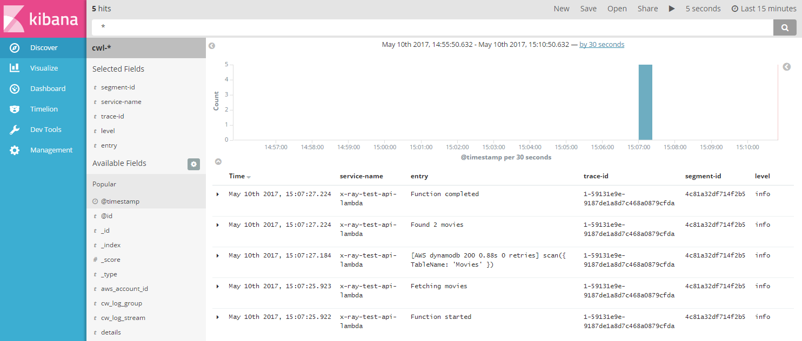
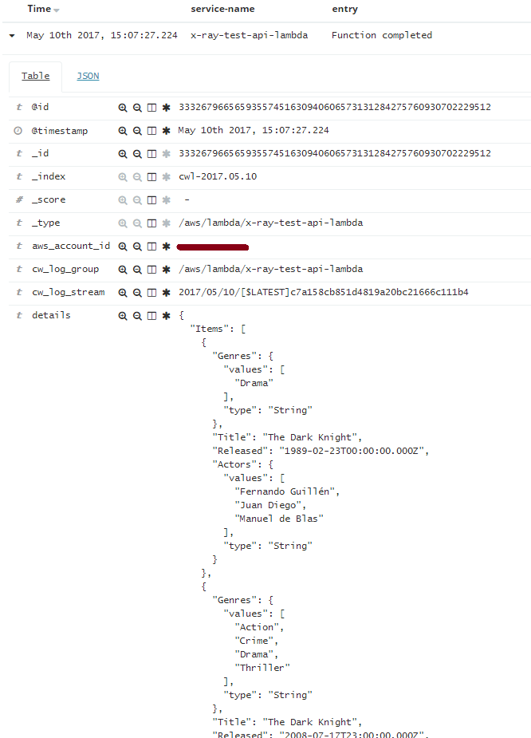
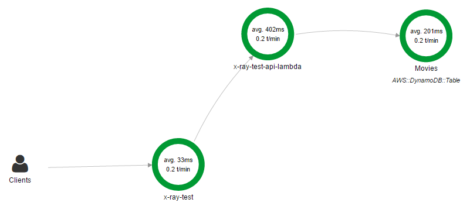
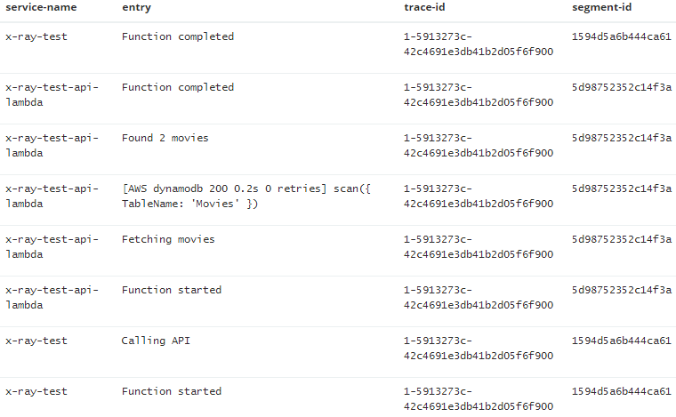

# Roast Lambda

Roast Lambda is an opinionated framework written by the engineers at [The Trainline](https://engineering.thetrainline.com/) which makes writing NodeJS AWS Lambda functions easier and which facilitates best practices when building micro-service based serverless solutions.

*Note: Roast Lambda is currently in development and should be considered unstable until v1. We are currently testing this approach with our own internal services.*

## Getting started

Our lambda functions look slightly different to traditional AWS Lambda functions. To understand the differences (and why we chose them) read the [What's Roast Lambda?](http://todo/) section.

Here's the obligatory hello world example:

```
exports.handler = () => Promise.resolve('Hello World');
```

Create the node module above with the name 'hello-world.js'. Next we need to convert this to a Lambda that AWS will recognise. Start by installing the framework as a dependency..
```
npm install roast-lambda --save
```

Roast your lambda in the oven, and then serve...

```
let rl = require('roast-lambda');
let lambda = require('./hello-world.js');

exports.handler = rl.init(lambda);
```

## What's Roast Lambda?

It's a tiny adapter which takes an easy-to-write module, containing lambda configuration and code, and turns it into something that AWS can run. By default, native AWS Lambdas require the developer to write a lot of boilerplate code (such as error handling, logging, tracing etc.). The adapter adds the boilerplate so that we don't have to. The result is that our Lambda modules are simpler to write - which is important if you're writing lots of them.

Specifically the adapter adds:

- Proper promise support and the elimination of callbacks
- A standard logging format for structured and non-structured logs
- Integration of AWS CloudWatch logs with ElasticSearch and Kibana
- Synchronous and asynchronous exception handling
- Inter-micro-service event tracing using AWS X-Ray
- Extended context info and easy access to environment variables

## Promise support

We're not big fans of callbacks. With AWS Lambda functions you either use the provided callback function, or call one of the context done/success/fail methods. Allowing lambdas to essentially exit at any point from deep within the code promotes bad design, and the use of callbacks in general makes our software difficult to read and maintain. We've removed these callbacks entirely in favour of promises.

Our lambda function handlers just return a promise. If it resolves, the execution was successful. If it rejects, the execution failed. It's that simple.

```
exports.handler = () => {
  return doAsyncThing()
    .then(doSomethingElse);
};
```

## Error handling

Roast Lambda will deal with synchronously thrown exceptions in the same way as promise rejections. This means that you don't need to wrap your code in Try Catch blocks to have unhandled exception dealt with properly.

Whenever a lambda is resolved or rejected the result or error value will be logged to CloudWatch in a standard format. AWS Lambda only properly supports Error type exceptions (containing string messages). We handle throwing objects as well as primitive values. All are logged in such a way that these values can be parsed from the logs easily at some other time.

## Extended context data

An AWS Lambda handler function has the following signature..

`(event, context, callback) => {}`

Our Lambda handler functions are slightly different..

`({event, context, AWS, logger}) => {}`

Notice that the function input is a single object rather than separate parameters. This is so that we can extend the number if inputs in the future without changing the function signature. Aside from removing the callback function we have provided two out of the box services which can be used...

- AWS: This is the AWS-SDK, but it has been instrumented for you to provide tracing information to AWS X-RAY. Use this instead of `require('aws-sdk')`
- logger: This logger has been set up to log entries to CloudWatch in a very particular way. For more details see [Logging](http://todo/) It supports all the usual methods such as `.info`, `.warn` and `.error`.

The context object is different from the traditional context object as well. The callback functions `.done`, `.success` and `.fail` have been removed and a few new properties have been added:

- awsAccountId: The id of the host AWS Account
- awsRegion: The AWS Region in which the lambda is running
- env: A dictionary of environment variables (same as `require('process').env`)

Here is an example lambda function which makes use of these services to output all movies from a DynamoDb table in the same AWS Region:

```
exports.handler = ({ context, logger, AWS }) => {
  logger.log('Fetching movies');
  let dynamo = new AWS.DynamoDB.DocumentClient({ region: context.awsRegion });
  return dynamo.scan({ TableName: 'Movies' }).promise();
};
```

## Logging

The logger service methods support 3 parameters: `message`, `details` and `attributes`. The following example lambda logs the fact that it is starting (the message), includes the event data so that users can see the input to the function (the details), and provides the host AWS region (one attribute)...

```
exports.handler = ({ event, context, logger }) => {
  logger.log('Function started.', event, { region: context.awsRegion });
}
```

The details and attributes parameters are optional. `logger.log('Function started.')` would work just fine. They are intended to provide extra/complex information if needed since log messages are always strings and therefore not used in structured logging. The difference between details and attributes is that attributes are specially selected as top-level queryable or sortable properties of the log entry when the log destination supports it (such as ElasticSearch).

In addition to the supplied parameters, a log entry is always recorded with the following attributes:

- level: `error`, `warn`, `info`, or `debug` depending on which logger method was called (logger.log === logger.info).
- service-name: The name of the lambda function
- segment-id and trace-id: See [Tracing]() for more information
- source: `service` unless overridden by the supplied attributes.

*Note: The AWS SDK also uses the logger and all aws entries are logged with a source attribute value of `aws-sdk`*

Here is an example of the log structure generated:

```
{
  "level": "info",
  "entry": "Function started",
  "service-name": "test-lambda",
  "segment-id": "b6db58f50dfb4a87",
  "trace-id": "1-59130353-5b282b659d8f83bcdae4d69f",
  "details": "{\n  \"key1\": \"value1\",\n  \"key2\": \"value2\"\n}",
  "source": "service"
}
```

All lambdas log when they start and include the event data details. They also log when they finish (resolve or reject), and include the result or error details.

## ElasticSearch Integration

The source code for this project contains the code for the [Log Shipper](http://link-to-code/); a lambda function which is designed to be triggered by CloudWatch log events and which sends log entries to an ElasticSearch instance.

It accepts a single environment variable with the key `ES_ENDPOINT` which must be set to the ElasticSearch endpoint to ship logs to. Currently this must be set-up manually.

All top-level attributes of the shipped log entries are queryable and can be used as filters in the Kibana UI. E.g..



Expanding the entry reveals the details of the entry...



Note that as well as the data described in the previous section, the log shipper also indexes the following data for each entry:

- id: CloudWatch entry id
- timestamp: The time the entry was logged
- aws_account_id: The id of the AWS account
- cw_log_group: The cloudwatch log group
- cw_log_stream: The cloudwatch log stream

## Tracing

Roast Lambda uses AWS X-RAY to allow us to trace the details of request execution as various micro-services call out other services. Each time a lambda begins it creates a new segment in what might be a chain of calls to other lambdas on which we depend.

The following shows our movie example in action. Here in the XRay console we can see a new lambda is calling our movie lambda in order to get the list of movies. That in turn calls the AWS-SDK to read the table...



Notice that the AWS-SDK provided by the library is instrumented so that AWS-SDK calls participate in a trace.

Each trace has a trace id which is unique across the call chain. Each lambda in the chain has its own segment id. Both of these values are logged which means you can use ElasticSearch to find all log entries for a particular trace across all services in your solution...



## Standard Http Requests

Most of our lambdas back AWS API Gateway resource methods. We do not usually use API Gateway request mapping templates because mapping happens before any of our code can execute, which is too early. We can't write generic re-usable code to help with standard http transport if every lambda has a different idea about what a request should look like. Instead we use the default AWS passthrough template for all lambdas. See [here](http://docs.aws.amazon.com/apigateway/latest/developerguide/api-gateway-mapping-template-reference.html#integration-passthrough-behaviors)

Here's an example request:

```
{
  "body-json": {},
  "params": {
    "path": {},
    "querystring": {},
    "header": {
      "Accept": "application/json",
      ...
    }
  }
  ...
```

One of the things that we use this standard request format for is tracing across API Gateway calls. AWS currently does not have an out of the box way to support this. If a Roast Lambda receives a request with the headers `TRACE_ID` and `TRACE_PARENT_SEGMENT` it will use this information to make sure it joins logging and trace calls to the existing trace as a subsegment of the calling service segment.